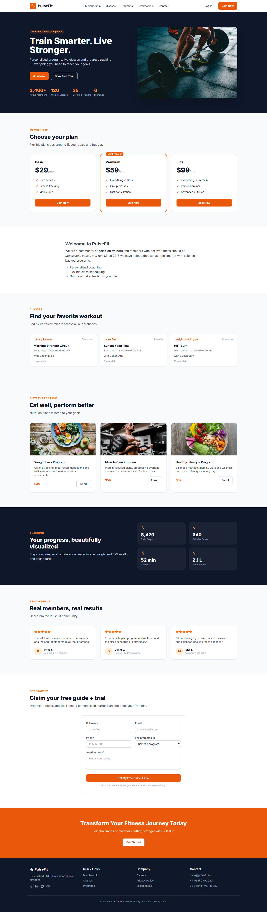
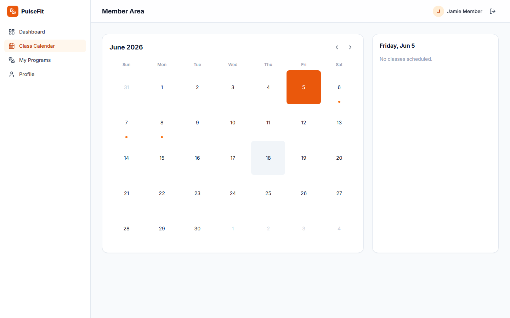
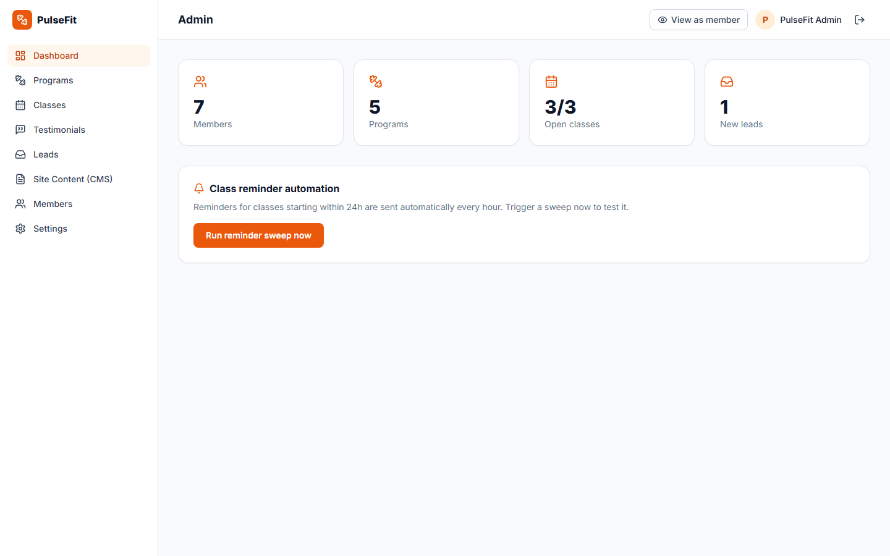
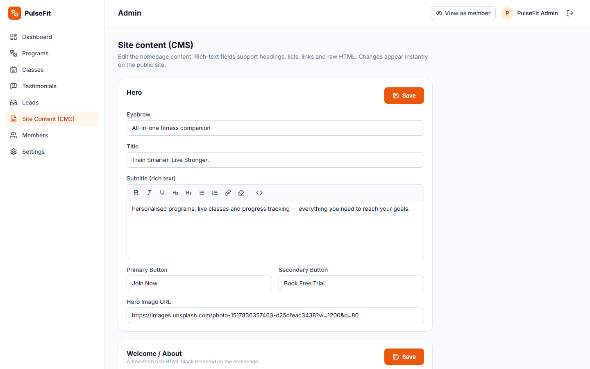
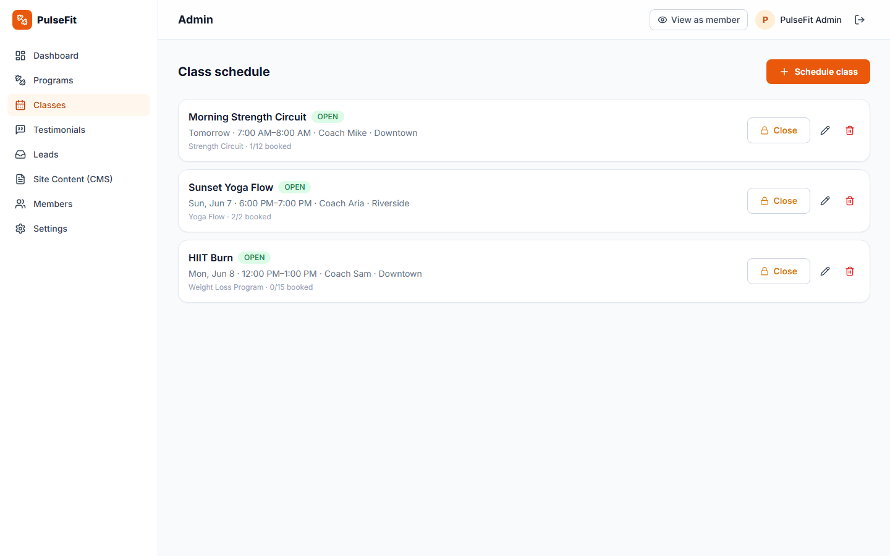
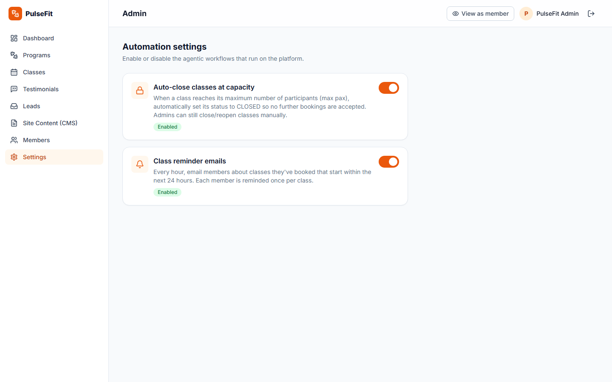

<div align="center">

# 🏋️ PulseFit — Full-Stack Fitness Platform

**Train Smarter. Live Stronger.**

A production-style fitness app: a conversion-focused marketing site, a member area with a
class calendar, and an admin CMS — plus two agentic automations (auto-close classes at
capacity and emailed class reminders).


</div>

---

## 📸 Screenshots

| Landing page | Member calendar |
| --- | --- |
| [](docs/screenshots/home.png) | [](docs/screenshots/member-calendar.png) |

| Admin dashboard | Site content (rich-text CMS) |
| --- | --- |
| [](docs/screenshots/admin-dashboard.png) | [](docs/screenshots/admin-cms.png) |

| Class scheduling | Automation settings |
| --- | --- |
| [](docs/screenshots/admin-classes.png) | [](docs/screenshots/admin-settings.png) |

---

## ✨ Features

- **Public site** (CMS-driven): hero, membership tiers, classes, dietary programs,
  tracking dashboard, testimonials carousel, CTA, footer — all editable from the admin.
- **Lead-magnet form** → submissions land in the admin Leads inbox with status tracking.
- **Auth:** email/password + **Google / Facebook / Instagram** OAuth. In dev the social
  buttons work instantly via a demo mock (no keys needed); add real keys to go live.
- **Member area:** dashboard, a class **calendar** with book/cancel, program enrollments,
  and a profile with **avatar upload, bio, and password reset**.
- **Admin CMS:** CRUD for programs, classes (scheduling + capacity), and testimonials;
  lead management; a **rich-text/HTML content editor** (WYSIWYG + raw-HTML source toggle);
  members list; and a **“View as member”** impersonation toggle.
- **Admin Settings:** flip the two agentic automations on/off.
- **Agentic automation #1 — auto-close:** a class flips to `CLOSED` the instant it hits
  capacity (race-safe transaction); admins can also close/reopen manually.
- **Agentic automation #2 — reminders:** an hourly cron emails members about classes
  starting within 24h (idempotent; console-mock without a Resend key).
- **Mobile-friendly** throughout, with a collapsible sidebar in the member/admin areas.

## 🧱 Tech stack

| Layer | Tech |
| --- | --- |
| Frontend | React 18, TypeScript, Tailwind CSS, Vite, React Router, TanStack Query |
| Backend | Node, Express, TypeScript, Prisma ORM |
| Database | PostgreSQL (Docker) |
| Auth | JWT (httpOnly cookie) + Passport.js (Google / Facebook / Instagram) |
| Email | Resend (console-mock fallback) |
| Automation | node-cron + transactional booking logic |

## 🚀 Quick start

```bash
# 1. Install all workspaces
npm install

# 2. Start PostgreSQL (Docker)
npm run db:up

# 3. Create schema + seed demo data
npm run db:migrate
npm run db:seed

# 4. Run client + server together
npm run dev
```

- **App:** http://localhost:5173
- **API:** http://localhost:4000/api

> Shortcut: `npm run setup` runs install → db up → migrate → seed in one go.

### Demo logins

| Role   | Email                   | Password    |
| ------ | ----------------------- | ----------- |
| Admin  | `admin@pulsefit.test`   | `Admin123!` |
| Member | `member@pulsefit.test`  | `Member123!`|

## ⚙️ Configuration (`server/.env`)

| Var | Purpose |
| --- | --- |
| `DATABASE_URL` | PostgreSQL connection string |
| `JWT_SECRET` | token signing secret |
| `RESEND_API_KEY` | email delivery — leave empty to log emails to the console |
| `GOOGLE_/FACEBOOK_/INSTAGRAM_CLIENT_ID/SECRET` | social login — add keys to activate each provider |

**Social login:** in development each button works out of the box via a demo mock
(labelled “(demo)”). To use real OAuth, register an app with the provider and set its
`*_CLIENT_ID` / `*_CLIENT_SECRET`; the button then performs the real flow. Callback URLs:
`http://localhost:4000/api/auth/{google|facebook|instagram}/callback`.

> Note: Instagram’s standalone OAuth (passport-instagram) uses the legacy Basic Display
> API; for new apps Meta routes Instagram login through Facebook Login. Google and
> Facebook are the reliable real providers today.

## 🤖 Testing the automations

- **Auto-close:** the seeded *Sunset Yoga Flow* class has capacity 2. Book it from two
  member accounts — the second booking flips it to `CLOSED` and a third is rejected.
  Toggle the behaviour under **Admin → Settings**.
- **Reminders:** **Admin → Dashboard → Run reminder sweep now**. Emails for any booked
  class < 24h away are sent (or logged to the console without a Resend key).

## 🗂️ Project layout

```
fitnessapp/
├── client/   # Vite + React + Tailwind SPA
│   └── src/{pages,components,lib}
├── server/   # Express API
│   ├── prisma/{schema.prisma,seed.ts}
│   └── src/{auth,routes,automation,middleware,lib,email}
└── docker-compose.yml
```

## 📜 Scripts

| Command | Description |
| --- | --- |
| `npm run dev` | client + server (concurrently) |
| `npm run db:migrate` | apply Prisma migrations |
| `npm run db:seed` | seed demo data |
| `npm run db:reset` | drop, re-migrate, re-seed |
| `npm run build` | production build of both workspaces |

---

<div align="center">
Built with the Tertiary Infotech Academy stack.
</div>
